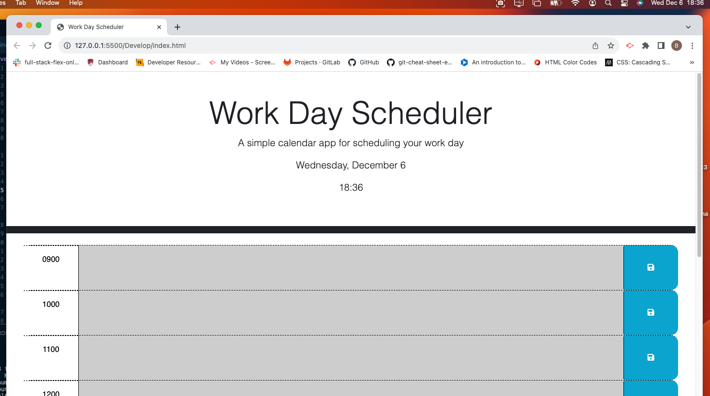

# Work Day Scheduler 
Work Day Scheduler!
A simple scheduler that displays the current date and time.
If a time slot is in the past the color will show as gray, if it is the curent hour it will show as red, and if it is in the future it will show as green!
Users can type in an event, click the save button and the data will be saved. Refreshing the page will not clear out he event!

# Preview of Site

# Scheduler Link
[Work Day Scheduler!](https://bryncidently.github.io/Homework-5/)

